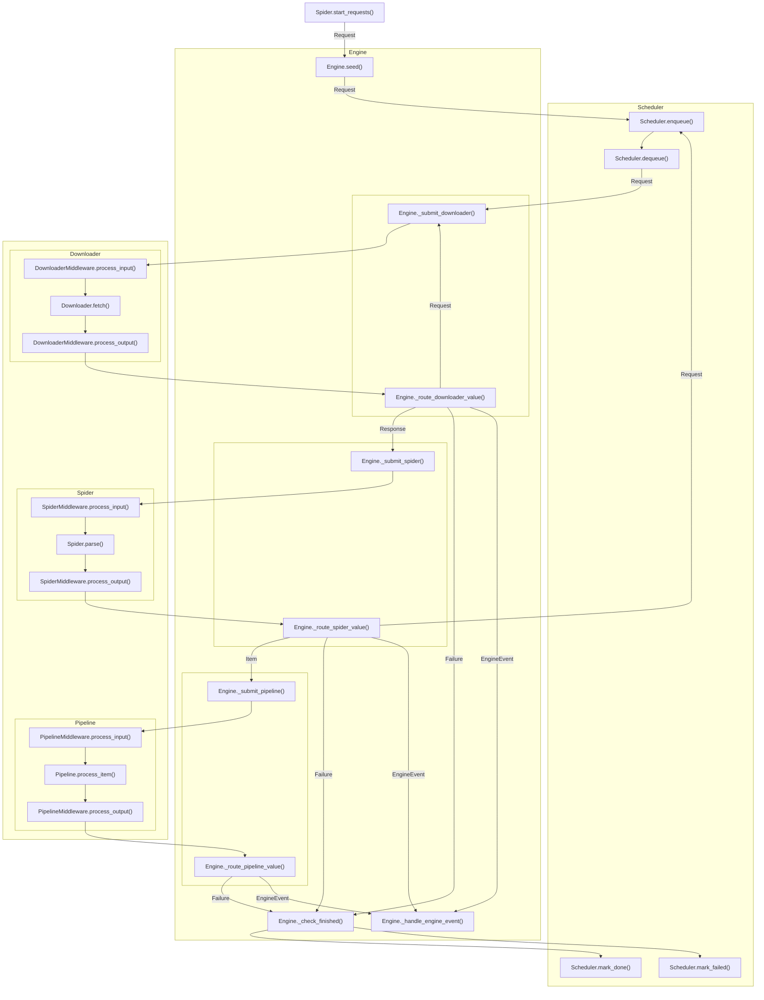

# Rubberneck

Rubberneck is an easy-to-use, multithreaded crawler framework.

## Package Layout

```text
rubberneck/
├── engine/       Runtime, routing
├── model/        Request, Response, Failure
├── scheduler/    Request queue
├── downloader/   Request -> Response
├── spider/       Response -> Item
├── pipeline/     Item consuming
├── logger/       Logger
└── registry/     Component registries
```

## Execution Flow

Rubberneck has six core runtime components: Engine, Scheduler, Downloader, Spider, Pipeline, and Logger.

Scheduler, Downloader, Spider, and Pipeline can run work in parallel; the Engine coordinates them and routes returned
values between components by type.



## Minimal Crawler

```python
from rubberneck import Engine, Item, Request, Response, Spider


class ExampleSpider(Spider):
    name = "example"

    def start_requests(self):
        yield Request("https://example.org/")

    def parse(self, response: Response):
        yield Item({"url": response.url, "status": response.status})


Engine(ExampleSpider()).run()
```

## Components

Runtime components can be replaced by passing **an instance, a registry name, or a `ComponentSpec`**.

```python
from rubberneck import ComponentSpec, Engine

engine = Engine(
    spider,
    scheduler='sqlite',
    downloader='session_pool',
    pipeline=ComponentSpec('sqlite', {'table': 'items'}),
    logger='standard',
)
```

### Engine

`Engine` wires the components together. Pass components; use `*_workers` to set stage concurrency.

When a `WorkOrder` finishes, the logger receives its `WorkOrder.payload` as `LoggerAction.DONE` and an `EngineStats` as `LoggerAction.SUMMARY`. The payload contains `EngineAction.COLLECT` values and per-order counts.

### Spider

Rubberneck does not provide a concrete spider. Implement `start_requests()` and `parse()`.

```python
from rubberneck import EngineAction, EngineEvent, Failure, Item, Request, Response, Spider


class ExampleSpider(Spider):
    name = 'example'

    def start_requests(self):
        yield Request('https://example.org/')  # Request: seed URL

    def parse(self, response: Response):
        yield Item({'url': response.url})  # Item: send data to pipeline
        yield Request('https://example.org/next')  # Request: enqueue subpages
        yield EngineEvent(EngineAction.COLLECT, {'seen': response.url})  # EngineEvent: control runtime
        yield Failure(response, RuntimeError('parse failed'), 'spider')  # Failure: mark this WorkOrder as failed
```

### Spider Middleware

Rubberneck does not provide concrete spider middlewares. A spider middleware receives a `Response` before parsing and the streamed parser output afterward.

### Scheduler

- `memory`: in-memory request queue for short runs and tests.
- `sqlite`: durable SQLite request queue (`path`, `filename`, `reset`, `codec`).

### Downloader

- `session_pool`: `requests` downloader with reusable sessions (`pool_size`, `max_host_pools`, `timeout`, `headers`, `session_factory`).
- `urllib`: simple `urllib.request` downloader (`timeout`).

### Downloader Middleware

- `cookies`: manages request and response cookies (`registry`, `key`, `max_jars`, `store`).
- `referer`: writes `Referer` from request meta (`meta_key`, `header_name`).
- `RetryDownloaderMiddleware`: retries downloader failures (`max_retries`); pass an instance directly.
- `ChallengeDownloaderMiddleware`: base class for challenge pages; override `is_challenge_page()` and `handle_challenge_page()`.

### Pipeline

- `sqlite`: writes `Item` rows to SQLite (`table`, `path`, `filename`, `unique_on`, `on_conflict`).

### Pipeline Middleware

Rubberneck does not provide concrete pipeline middlewares. A pipeline middleware receives an `Item` before the pipeline and the streamed pipeline output afterward.

### Logger

- `standard`: writes engine records through Python `logging` (`name`, `logger`, `summary_every`, `actions`).

## Installation

```sh
python -m pip install .
```
