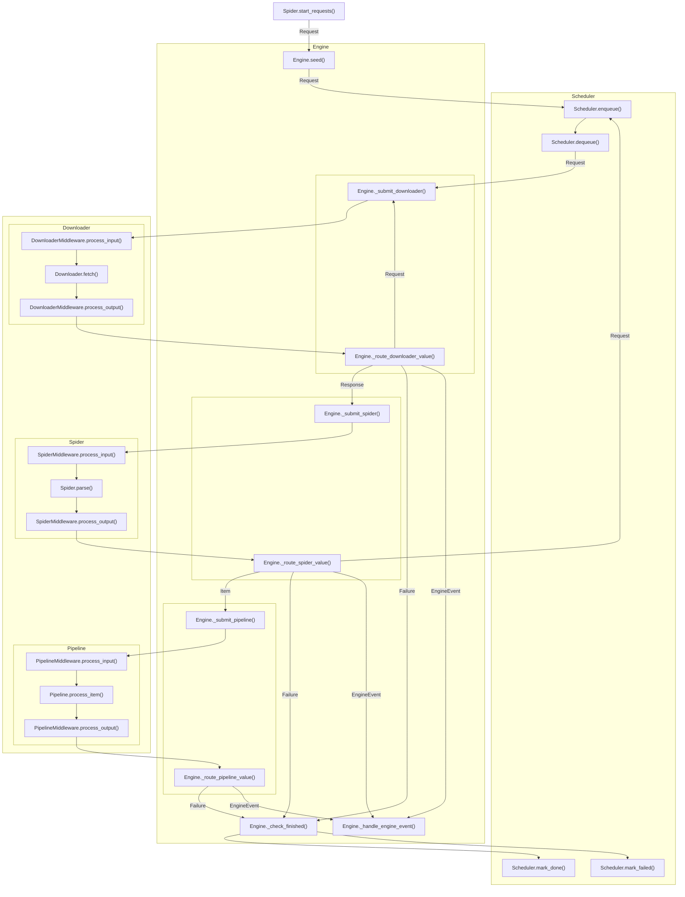

# Rubberneck

Rubberneck is an easy-to-use, multithreaded crawler framework.

## Package Layout

```text
rubberneck/
├── engine/       Runtime, routing
├── model/        Request, Response, Failure
├── scheduler/    Request queue
├── downloader/   Request -> Response
├── spider/       Response -> Item
├── pipeline/     Item consuming
├── logger/       Runtime logging
└── registry/     Component registries
```

## Execution Flow

Rubberneck has six core runtime components: Engine, Scheduler, Downloader, Spider, Pipeline, and Logger.

Scheduler, Downloader, Spider, and Pipeline can run work in parallel; the Engine coordinates them and routes returned
values between components by type.



## Model Types

A `WorkOrder` is the engine's internal unit of work for one leased root `Request`.
It:
- Tracks all downloader, spider, and pipeline tasks spawned from that request.
- Collects per-order payload and counters.
- Is marked done or failed only after all related tasks are idle.

| Type | Fields | Purpose |
| --- | --- | --- |
| `Request` | `url`, `method`, `headers`, `body`, `meta`, `priority` | A crawl request. Spiders create it, schedulers queue it, downloaders fetch it. Duplicate filtering uses `fingerprint()`, which is based on method, URL, and body. |
| `Response` | `url`, `status`, `body`, `headers`, `request`, `cookies` | Downloader output and spider input. Use `text` for charset-aware body decoding. |
| `Item` | `data` | A mapping-like object emitted by spiders and consumed by pipelines. |
| `Failure` | `value`, `exception`, `stage` | A component-level failure. Returning it marks the current work order as failed. |
| `EngineEvent` | `action`, `payload`, `log` | A control message from a component to the engine. Details are below. |

**EngineEvent Actions**:

| Action | Payload | Effect |
| --- | --- | --- |
| `EngineAction.NONE` | Optional | Does not change runtime state. If `log` is set, the engine emits that log record. |
| `EngineAction.COLLECT` | Any mapping | Merges values into the current `WorkOrder.payload`. Integer values are accumulated as counters; other values replace the previous value for that key. |
| `EngineAction.STOP_GRACEFULLY` | Optional `reason` | Stops taking new scheduler requests, lets running work finish, then emits a stopped log record. |
| `EngineAction.STOP_NOW` | Optional `reason` | Fails the current work order, cancels running futures where possible, stops scheduling immediately, then emits a stopped log record. |

Example:

```python
from rubberneck import EngineAction, EngineEvent

yield EngineEvent(EngineAction.COLLECT, {"pages": 1, "last_url": response.url})
```

After several responses, `pages` is accumulated while `last_url` keeps the most recent URL.

## Minimal Crawler

```python
from rubberneck import Engine, Item, Request, Response, Spider


class ExampleSpider(Spider):
    name = "example"

    def start_requests(self):
        yield Request("https://example.org/")

    def parse(self, response: Response):
        yield Item({"url": response.url, "status": response.status})


Engine(ExampleSpider()).run()
```

## Components

Runtime components can be passed as an instance, a registry name, or a `ComponentSpec` with constructor options.

```python
from rubberneck import ComponentSpec, Engine

engine = Engine(
    spider,
    scheduler='sqlite',
    downloader='session_pool',
    pipeline=ComponentSpec('sqlite', {'table': 'items'}),
    logger='standard',
)
```

<table>
  <thead>
    <tr>
      <th>Component</th>
      <th>Key method</th>
      <th>Input and output</th>
      <th>Provided implementations</th>
    </tr>
  </thead>
  <tbody>
    <tr>
      <td><code>Engine</code></td>
      <td><code>run()</code></td>
      <td>Input: a <code>Spider</code> plus optional scheduler, downloader, pipeline, logger, middleware lists, and worker counts. Output: <code>EngineStats</code>.</td>
      <td><code>Engine</code> coordinates lifecycle, worker pools, routing, stop handling, and final done/failed acknowledgement.</td>
    </tr>
    <tr>
      <td rowspan="4"><code>Scheduler</code></td>
      <td><code>enqueue(request)</code></td>
      <td>Input: a <code>Request</code>. Output: <code>True</code> if accepted, <code>False</code> if filtered as duplicate.</td>
      <td rowspan="4"><code>memory</code> is an in-memory queue for tests and short runs. <code>sqlite</code> is durable and recovers leased/failed requests as pending on restart.</td>
    </tr>
    <tr>
      <td><code>dequeue()</code></td>
      <td>Input: none. Output: the next leased <code>Request</code>, or <code>None</code> when no request is pending.</td>
    </tr>
    <tr>
      <td><code>mark_done(request)</code></td>
      <td>Input: a leased <code>Request</code>. Output: none; records successful completion.</td>
    </tr>
    <tr>
      <td><code>mark_failed(request, error)</code></td>
      <td>Input: a leased <code>Request</code> and an exception. Output: none; records failed completion.</td>
    </tr>
    <tr>
      <td><code>Downloader</code></td>
      <td><code>fetch(request)</code></td>
      <td>Input: one <code>Request</code>. Output: <code>Response</code>, downloader-local <code>Request</code>, <code>Failure</code>, or <code>EngineEvent</code>.</td>
      <td><code>session_pool</code> uses reusable <code>requests.Session</code> objects. <code>urllib</code> uses the standard library.</td>
    </tr>
    <tr>
      <td rowspan="2"><code>DownloaderMiddleware</code></td>
      <td><code>process_input(request)</code></td>
      <td>Input: a <code>Request</code> before fetch. Output: the request to pass to the downloader.</td>
      <td rowspan="2"><code>cookies</code> manages cookie jars. <code>referer</code> sets and propagates <code>Referer</code>. <code>RetryDownloaderMiddleware</code> retries failures. <code>ChallengeDownloaderMiddleware</code> is a base class for challenge flows.</td>
    </tr>
    <tr>
      <td><code>process_output(request, output)</code></td>
      <td>Input: the request and downloader output stream. Output: modified output stream.</td>
    </tr>
    <tr>
      <td rowspan="2"><code>Spider</code></td>
      <td><code>start_requests()</code></td>
      <td>Input: none. Output: seed <code>Request</code> values for the scheduler.</td>
      <td rowspan="2">No built-in implementation is provided yet; implement it for each site.</td>
    </tr>
    <tr>
      <td><code>parse(response)</code></td>
      <td>Input: one <code>Response</code>. Output: <code>Request</code>, <code>Item</code>, <code>Failure</code>, or <code>EngineEvent</code>.</td>
    </tr>
    <tr>
      <td rowspan="2"><code>SpiderMiddleware</code></td>
      <td><code>process_input(response)</code></td>
      <td>Input: a <code>Response</code> before parsing. Output: the response to pass to the spider.</td>
      <td rowspan="2">No built-in implementation is provided yet.</td>
    </tr>
    <tr>
      <td><code>process_output(response, output)</code></td>
      <td>Input: the response and spider output stream. Output: modified output stream.</td>
    </tr>
    <tr>
      <td><code>Pipeline</code></td>
      <td><code>process_item(item)</code></td>
      <td>Input: one <code>Item</code>. Output: <code>Failure</code> or <code>EngineEvent</code>. A successful call increments the per-order <code>processed</code> counter.</td>
      <td><code>sqlite</code> writes item data to SQLite, creating the table and adding columns as item keys appear.</td>
    </tr>
    <tr>
      <td rowspan="2"><code>PipelineMiddleware</code></td>
      <td><code>process_input(item)</code></td>
      <td>Input: an <code>Item</code> before pipeline processing. Output: the item to pass to the pipeline.</td>
      <td rowspan="2">No built-in implementation is provided yet.</td>
    </tr>
    <tr>
      <td><code>process_output(item, output)</code></td>
      <td>Input: the item and pipeline output stream. Output: modified output stream.</td>
    </tr>
    <tr>
      <td><code>Logger</code></td>
      <td><code>emit(record)</code></td>
      <td>Input: one <code>LogRecord</code>. Output: none.</td>
      <td><code>standard</code> emits records through Python <code>logging</code>, with action filtering and periodic summaries.</td>
    </tr>
  </tbody>
</table>

## Installation

From the project root directory, install the package with:

```sh
python -m pip install .
```

For development, install it in editable mode:

```sh
python -m pip install -e .
```
