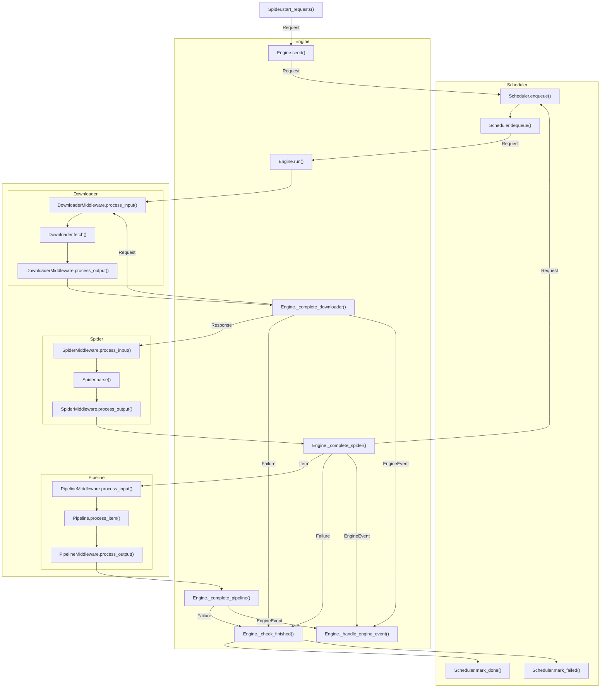

# Rubberneck

Rubberneck is an easy-to-use, multithreaded crawler framework.

## Package Layout

```text
rubberneck/
├── engine/       Runtime, routing
├── model/        Request, Response, Failure
├── scheduler/    Request queue
├── downloader/   Request -> Response
├── spider/       Response -> Item
├── pipeline/     Item consuming
├── logger/       Logger
└── registry/     Component registries
```

## Execution Flow

Rubberneck has six core runtime components: Engine, Scheduler, Downloader, Spider, Pipeline, and Logger.

Scheduler, Downloader, Spider, and Pipeline can run work in parallel; the Engine coordinates them and routes returned
values between components by type.



## Minimal Crawler

```python
from rubberneck import Engine, Item, Request, Response, Spider


class ExampleSpider(Spider):
    name = "example"

    def start_requests(self):
        yield Request("https://example.org/")

    def parse(self, response: Response):
        yield Item({"url": response.url, "status": response.status})


Engine(ExampleSpider()).run()
```

## Components

Runtime components can be replaced by passing an instance, a registry name, or a `ComponentSpec`.

```python
from rubberneck import ComponentSpec, Engine

engine = Engine(
    spider,
    logger='logger'
scheduler = ComponentSpec('sqlite', {'path': './data'}),
)
```

## Installation

```sh
python -m pip install .
```
